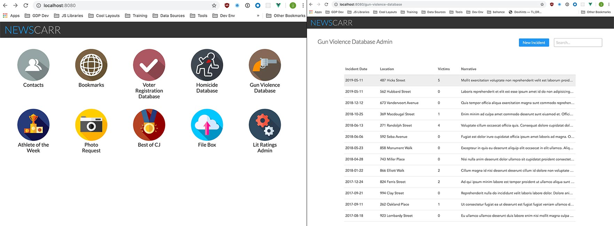

# Newscarr Frontend
A modular app-driven dashboard developed and used internally by Courier Journal staff. Holds tools, databases, commonly used lists and admin panels to make our jobs a little easier.



## App Structure
Uses VueJS + Vue Router + LESS. Each "app" is an individual SFC that contains all frontend logic for that particular scope. The monolithic nature and ability to extend and build new apps using existing global components makes dev time much quicker than starting from scratch. Future plans include the ability to eject each app with NUXT so we can wrap just that app and it's backend in a container to make it more portable.

`public/` - Everything in here is copied over to `dist/` at build time.

`src/apps/` - Every app including the homepage is in it's own subdirectory as an index.vue file. Components specific to that app also live in the subdirectory.

`src/apps/apps.json` - A list of all available apps and their meta data. This file bootstraps the router as well as defines what appears on the homepage.

`assets/` - contains all globaly used assets including style sheets.

`global-components/` - generic reusable components that can be used by any app.

# Standard dev stuff (Vue Cli)
## Project setup
```
npm install
```

### Compiles and hot-reloads for development
```
npm run serve
```

### Compiles and minifies for production
```
npm run build
```

### Run your tests
```
npm run test
```

### Lints and fixes files
```
npm run lint
```

### Customize configuration
See [Configuration Reference](https://cli.vuejs.org/config/).
