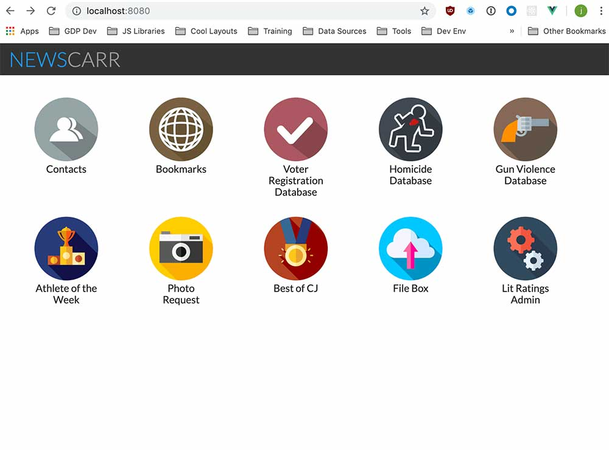
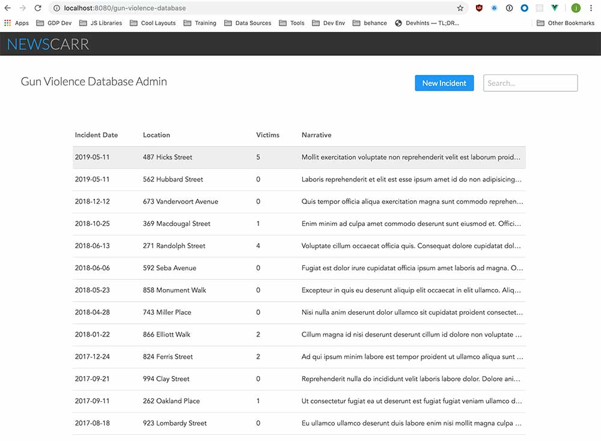

# Newscarr Frontend
A modular app-driven dashboard developed and used internally by Courier Journal staff. Holds tools, databases, and admin panels to make our lives a little easier. Special care has been given to the UI/UX to mimic modern smartphones and make the experience as frictionless as possible.
 

## App Structure
Uses VueJS + Vue Router + LESS. Each "app" is an inidvidual SFC file that contains all logic for that app.

`src/apps/` - Every app including the homepage is in it's own subdirectory as an index.vue SFC file. Components specific to that app also live alongside the

`src/apps/apps.json` - A list of all available apps. This file bootstraps the router as well as defines what appears on the homepage.

`assets/` - contains all globaly used assets including style sheets.

`global-components/` - generic reusable components that can be used by any app.

# Standard dev stuff (Vue Cli)
## Project setup
```
npm install
```

### Compiles and hot-reloads for development
```
npm run serve
```

### Compiles and minifies for production
```
npm run build
```

### Run your tests
```
npm run test
```

### Lints and fixes files
```
npm run lint
```

### Customize configuration
See [Configuration Reference](https://cli.vuejs.org/config/).
